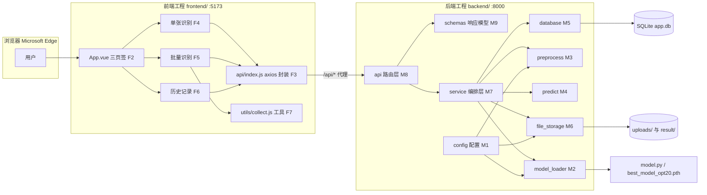
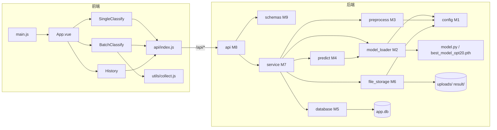
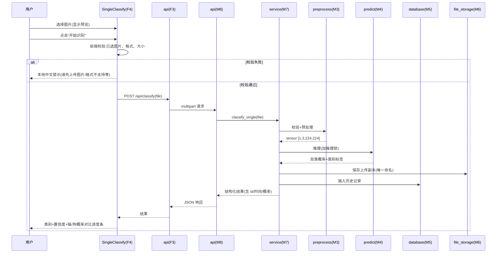
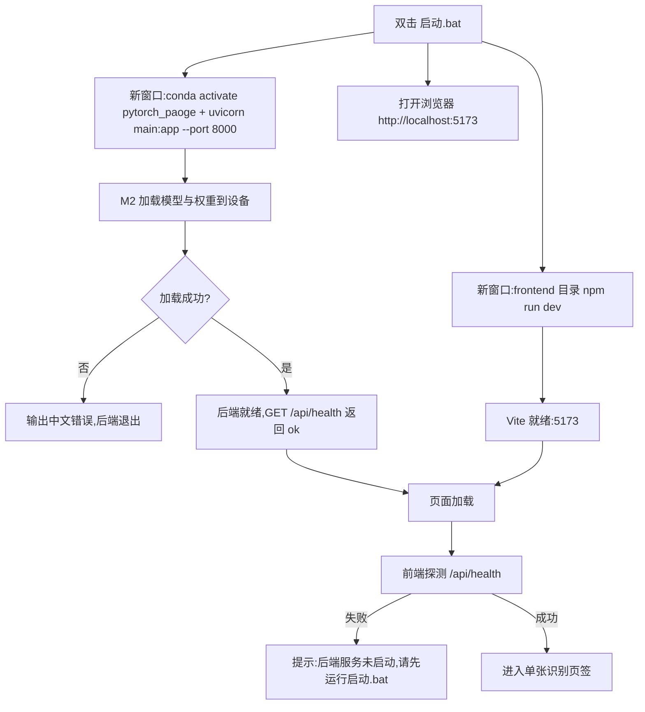

# 猫狗分类软件概要设计文档(high-level-design)

> 文档版本:v1.0 ｜ 编写日期:2026-09-10 ｜ 状态:设计决策已与用户逐项确认,待评审
> 依据文档:`doc/proposal.md`(需求文档 v1.0)
> 项目目录:`D:\exercise\paoge_pytorch\fastaapi_cat_dog`
> 技术栈:后端 FastAPI + Uvicorn(端口 8000),前端 Vue3 + Vite + Element Plus(端口 5173),SQLite

## 1. 引言

### 1.1 编写目的

本文档依据需求文档 `doc/proposal.md`,对"猫狗分类软件 v1.0"进行概要设计:划分前后端模块、明确各模块职责与相互之间的关系、描述关键流程(单张识别、批量异步任务、历史管理、启动)与异常处理,作为后续详细设计与编码的直接依据。文档结构与旧版 Gradio 项目的 `high-level-design.md` 保持一致,并针对前后端分离架构做了扩展。

### 1.2 设计范围

- 覆盖需求文档全部本期范围:**单张识别、批量识别(异步任务 + 实时进度)、历史记录(增删查与导出)、一键启动**。
- **不设计**以下非本期范围:用户登录/注册、摄像头实时识别、训练/测试入口、非猫狗拒识、界面内切换模型/权重、局域网或公网部署。
- 模型能力基线(测试准确率约 91.88%)仅作参照;软件不改变模型与权重。

### 1.3 术语

| 术语 | 说明 |
| --- | --- |
| 模块 | 后端指 `backend/` 下职责单一的 Python 源文件(M1–M9);前端指 `frontend/src/` 下的组件/脚本文件(F1–F7);启动脚本单独编号 S1。 |
| 任务(job) | 一次批量识别请求对应的后台处理单元,具有唯一 `job_id`,状态保存在后端内存。 |
| JobRegistry | 后端内存中的任务注册表,负责批量任务的创建、进度更新、查询与清理。 |
| 置信度 | softmax 后最大类别的概率值,展示保留 1 位小数(如 92.4%)。 |
| ImageFolder 类别序 | `cat` 目录在前(索引 0 → "猫")、`dog` 在后(索引 1 → "狗")。 |

### 1.4 对需求文档的修订说明

以下为设计阶段与用户确认后,对 `doc/proposal.md` 的修订,开发与验收以本节为准:

1. **批量识别改为异步任务 + 实时进度**(修订 proposal §6):用户确认后,`POST /api/batch` 不再同步返回全部结果,而是立即返回 `job_id`;前端每隔约 1 秒轮询新增接口 `GET /api/batch/status/{job_id}` 获取进度,完成后取得汇总、结果表与 CSV 下载地址。proposal §6 中"批量接口一次返回全部结果"的响应示例作废,由本设计 §4.3/§4.4 取代;批量图片逐张写入历史、CSV 存 `result/` 等约定不变。
2. **任务状态仅内存保存、不支持取消**(用户确认):后端重启或页面刷新后,旧任务的进度查询返回"任务不存在或已失效";已完成图片的结果已实时写入历史记录,数据不丢失。
3. **新增 `GET /api/health` 健康检查接口**(支撑 TC-13):前端据此探测后端是否就绪,给出"后端服务未启动"的友好提示。
4. 其余接口、数据、验收用例(TC-01～TC-14)均按 proposal 执行;另补充设计级验收用例 TC-15～TC-17,见 §9。

## 2. 设计约束与原则

1. **复用不改动**:复用现有 `model.py`(`ResNet`/`residual`)与根目录权重 `best_model_opt20.pth`;不改动 `model.py`、`model_train.py`、`model_test.py`、权重文件。
2. **前后端分离**:后端工程 `backend/`(Python,端口 8000)与前端工程 `frontend/`(Node.js,端口 5173)独立启动;开发期由 Vite 代理将 `/api` 转发到 8000,后端不依赖 CORS。
3. **依赖最小化**:后端仅新增 `fastapi`、`uvicorn`、`python-multipart`;数据库用 Python 标准库 `sqlite3`,不引入 ORM;前端依赖 `vue`、`vite`、`element-plus`、`axios`,**不引入 Pinia**,批量任务不引入任务队列库(用内置线程实现)。
4. **中文界面**:页面与所有提示均为简体中文。
5. **预处理一致**:推理预处理参数与 `model_train.py` 完全一致(`Resize((224,224))`、`ToTensor()`、`Normalize(mean=[0.4861, 0.453, 0.4153], std=[0.2628, 0.2555, 0.2583])`),上传图片统一转 RGB。
6. **设备自适应**:有 CUDA 用 GPU,否则自动回退 CPU。
7. **模型常驻 + 推理串行化**:模型在启动时加载一次并常驻内存;推理入口经全局推理锁串行化,避免单张/批量并发请求竞争 GPU。
8. **任务内存态**:批量任务状态仅存后端内存(见 §1.4),每张结果实时落库。
9. **接口实现风格**:处理阻塞推理的接口用普通 `def`(FastAPI 自动放入线程池执行);批量任务在独立后台线程中逐张处理。
10. **双重校验**:文件格式/大小在前端(即时友好提示)与后端(权威校验)各校验一次;批量上限为单次 ≤ 500 张、单张 ≤ 10 MB。

## 3. 总体架构与模块划分

### 3.1 总体架构

系统为"浏览器 + 前端工程 + 后端工程"结构:浏览器只与前端(Vite,5173)交互;前端只经 `/api` 与后端(FastAPI,8000)交互;后端内部按"API 层 → 服务编排层 → 能力层 → 资源层"分层。



分层说明:

- **表现层**(前端):三个视图组件 + axios 接口封装,负责展示与交互。
- **API 层**(M8/M9):FastAPI 路由、请求解析、统一错误响应、静态文件挂载。
- **服务编排层**(M7):单张识别编排、批量任务编排与进度管理、历史导出编排。
- **能力层**(M2–M6):模型加载、预处理、推理、数据库访问、文件与 CSV 读写。
- **资源层**:配置常量(M1)、现有网络定义与权重、SQLite、`uploads/`、`result/`。

### 3.2 模块清单(后端 M1–M9)

| 编号 | 模块 | 职责 | 输入 | 输出 | 主要依赖 |
| --- | --- | --- | --- | --- | --- |
| M1 | config | 定义权重路径、类别映射、预处理参数、目录约定、批量上限、CSV 列名、全部中文提示文案等常量 | 无 | 供 M2–M8 使用的常量 | 无 |
| M2 | model_loader | 导入 `ResNet/residual`,构建模型,加载权重到设备并 `eval()`;启动时加载一次;提供全局推理锁 | 权重路径、设备(来自 M1) | 就绪模型 + 推理锁 | M1、`model.py`、权重文件 |
| M3 | preprocess | 校验图片可解码并统一转 RGB;执行与训练一致的 transform;升维到 `[1,3,224,224]` | 上传图片文件 | 模型输入 tensor 或校验失败信息 | M1 |
| M4 | predict | 加推理锁,`torch.no_grad()` 前向推理,softmax 得双类概率,映射类别标签,格式化输出 | tensor | `{predict, predict_label, confidence, probs}` | M1、M2、M3 |
| M5 | database | SQLite 建表、插入记录、分页查询、按 id 查询、删除单条、清空、全量查询(供导出) | SQL 参数 | 记录/列表/删除条数 | M1(sqlite3 标准库) |
| M6 | file_storage | 保存上传副本(原名+时间戳唯一命名)、删除指定文件、生成批量结果 CSV 与历史导出 CSV(utf-8-sig) | 文件对象/记录列表 | 存储路径/CSV 文件路径 | M1(csv 标准库) |
| M7 | service | 业务编排:单张识别(预处理→推理→存图→落库)、批量任务(创建任务、后台线程逐张处理、更新进度、汇总、写 CSV)、历史导出;内含 JobRegistry 内存任务注册表 | 文件/任务查询参数 | 结构化结果/任务状态 | M2、M3、M4、M5、M6、M1 |
| M8 | api | FastAPI 路由:单张/批量/任务状态/历史/导出/健康检查;统一错误响应 `{"detail": 中文}`;挂载 `/uploads`、`/result` 静态目录;启动时调用 M2 | HTTP 请求 | HTTP 响应(JSON/文件) | M7、M9、M1、M2 |
| M9 | schemas | Pydantic 请求/响应模型定义(字段、类型、示例) | 无 | 响应模型类 | 无 |

### 3.3 模块清单(前端 F1–F7 与启动 S1)

| 编号 | 模块 | 职责 | 输入 | 输出 | 主要依赖 |
| --- | --- | --- | --- | --- | --- |
| F1 | main.js | 创建 Vue 应用、注册 Element Plus、挂载根组件 | 无 | 运行中的 SPA | vue、element-plus |
| F2 | App.vue | 三页签布局(el-tabs):单张识别/批量识别/历史记录;全局标题 | 无 | 页面框架 | F4、F5、F6 |
| F3 | api/index.js | axios 实例与全部接口函数;统一错误拦截(后端未启动/请求失败中文提示);任务状态轮询封装 | 页面调用 | Promise 结果或统一错误提示 | axios、M8 接口约定 |
| F4 | SingleClassify.vue | 上传控件(el-upload)+ 图片预览 + "开始识别"按钮 + 结果区(类别、置信度、猫/狗双 `el-progress` 概率对比条);前端格式/大小校验 | 用户操作 | 页面渲染与提示 | F3 |
| F5 | BatchClassify.vue | 两种提交入口(多选文件、选择文件夹);提交后轮询任务状态,渲染进度条(百分比+当前文件名);完成后展示结果表格、汇总统计、CSV 下载 | 用户操作/任务状态 | 页面渲染与提示 | F3、F7 |
| F6 | History.vue | 分页列表(el-table + el-image 缩略图)、删除单条、清空全部、导出 CSV;切换页签时刷新 | 用户操作 | 页面渲染与提示 | F3 |
| F7 | utils/collect.js | 工具函数:文件夹递归收集图片(webkitdirectory)、文件格式/大小校验、百分比格式化 | 文件列表/数值 | 校验结果/格式化文本 | 无 |
| S1 | 启动.bat | 一键启动:新窗口启动后端(conda 激活 + uvicorn)、新窗口启动前端(npm run dev)、打开浏览器 5173 | 双击 | 运行中的双服务与浏览器页面 | M8、F1 |

## 4. 模块间关系与数据流

### 4.1 模块依赖关系



依赖规则:

- 前端视图组件只调用 F3(axios 封装),不直接拼请求地址与错误文案;F2 只做布局。
- 后端 M8 只做路由与协议转换,业务编排全部在 M7;M7 是唯一调用 M3/M4/M5/M6 的编排者。
- M2 是唯一直接使用现有 `model.py` 与权重文件的模块;M5 是唯一访问 SQLite 的模块;M6 是唯一写 `uploads/`/`result/` 的模块。
- M1 被能力层与 API 层引用,统一提供配置与中文文案,避免各处硬编码。
- 单张与批量共用同一套 M3→M4→M2 推理链;推理经 M2 提供的全局锁串行化。

### 4.2 关键流程时序

#### (1) 单张识别



#### (2) 批量识别(异步任务 + 实时进度)

```mermaid
sequenceDiagram
    participant U as 用户
    participant V as BatchClassify(F5)
    participant A as api(F3)
    participant R as api(M8)
    participant S as service(M7+JobRegistry)
    participant W as 任务线程
    participant D as database(M5)
    participant Fs as file_storage(M6)

    U->>V: 多选图片文件 或 选择文件夹(F7 收集)
    U->>V: 点击"开始批量识别"
    V->>A: POST /api/batch(files)
    A->>R: multipart 请求
    R->>S: 校验数量/大小,创建任务 job_id
    S-->>R: {job_id, total}
    R-->>V: {job_id, total}
    S->>W: 启动后台线程逐张处理
    loop 每 1 秒轮询,直至终态
        V->>A: GET /api/batch/status/{job_id}
        A->>R->>S: 读取任务状态
        S-->>V: {status, done, total, percent, current_filename}
        V-->>U: 更新进度条与当前文件名
    end
    W->>W: 每张:预处理→推理→存图→写历史→done+1
    W->>Fs: 全部完成后写 CSV(result/)
    W->>S: 写入汇总,status=succeeded
    V->>V: 终态轮询拿到 summary/results/csv_url
    V-->>U: 结果表格+汇总统计+CSV 下载
```

说明:批量中每一张的处理与单张识别共用 M3→M4→M2 推理链,每张结果实时写入历史(M5),与单张识别产生并发时由全局推理锁串行执行。

#### (3) 历史记录:查询 / 删除 / 导出

```mermaid
sequenceDiagram
    participant U as 用户
    participant V as History(F6)
    participant A as api(F3)
    participant R as api(M8)
    participant D as database(M5)
    participant Fs as file_storage(M6)

    U->>V: 打开"历史记录"页签
    V->>A: GET /api/history?page=&page_size=
    A->>R->>D: 分页查询
    D-->>V: items(含 image_url 缩略图地址)
    V-->>U: 分页列表(原图缩放显示)
    U->>V: 删除单条
    V->>A: DELETE /api/history/{id}
    R->>D: 查记录并删除(取 stored_path)
    R->>Fs: 删除 uploads/ 中对应图片文件
    R-->>V: {ok:true}
    U->>V: 清空全部
    V->>A: DELETE /api/history
    R->>D: 取出全部 stored_path 后清空表
    R->>Fs: 批量删除对应图片文件
    R-->>V: {ok:true, deleted:n}
    U->>V: 导出 CSV
    V->>A: GET /api/history/export
    R->>D: 全量查询
    R->>Fs: 生成 history_YYYYmmdd_HHMMSS.csv 存 result/
    R-->>U: CSV 下载
```

#### (4) 启动流程



### 4.3 接口汇总表

后端基址 `http://127.0.0.1:8000`,前端经 Vite 代理以 `/api` 前缀访问;失败统一返回 `{"detail": "中文提示"}`。

| 方法 | 路径 | 请求 | 响应 | 归属模块 | proposal 对应 |
| --- | --- | --- | --- | --- | --- |
| POST | `/api/classify` | multipart `file` | 单张结果(同 proposal §6 示例) | M8/M7/M9 | §6 |
| POST | `/api/batch` | multipart `files[]` | `{"job_id": "...", "total": n}` | M8/M7/M9 | §6(修订,见 §1.4) |
| GET | `/api/batch/status/{job_id}` | 路径参数 | 任务状态(见 §4.4) | M8/M7/M9 | 设计新增 |
| GET | `/api/history` | `page`、`page_size` | `{total, page, page_size, items[]}` | M8/M5/M9 | §6 |
| DELETE | `/api/history/{id}` | 路径参数 | `{"ok": true}` | M8/M5/M6 | §6 |
| DELETE | `/api/history` | 无 | `{"ok": true, "deleted": n}` | M8/M5/M6 | §6 |
| GET | `/api/history/export` | 无 | CSV 文件下载(同时存 `result/`) | M8/M5/M6 | §6 |
| GET | `/api/health` | 无 | `{"status": "ok"}` | M8 | 设计新增(TC-13) |
| GET | `/uploads/{filename}` | 路径参数 | 上传图片文件 | M8 静态挂载 | §6 |
| GET | `/result/{csv_filename}` | 路径参数 | CSV 文件 | M8 静态挂载 | §7.3 |

### 4.4 任务状态响应示例(`GET /api/batch/status/{job_id}`)

```json
// 进行中
{"job_id": "a1b2c3d4-...", "status": "running", "total": 100, "done": 37,
 "percent": 37.0, "current_filename": "cat_038.jpg"}

// 成功(终态,携带汇总、结果表与 CSV 地址)
{"job_id": "a1b2c3d4-...", "status": "succeeded", "total": 100, "done": 100, "percent": 100.0,
 "summary": {"total": 100, "success": 98, "failed": 2, "cat_count": 50, "dog_count": 48},
 "csv_url": "/result/batch_result_20260910_140000.csv",
 "results": [
   {"filename": "a.jpg", "predict_label": "猫", "confidence": 0.924, "remark": ""},
   {"filename": "坏文件.txt", "predict_label": "-", "confidence": null,
    "remark": "无法读取该图片,请上传 jpg/png/bmp 等图片文件"}
 ]}

// 失败(终态,整体异常时)
{"job_id": "a1b2c3d4-...", "status": "failed", "error": "识别失败,请重试"}
```

状态机:`queued → running → succeeded / failed`;查询不存在的 `job_id` 返回 404 `{"detail": "任务不存在或已失效(后端可能已重启)"}`。

## 5. 数据结构与存储设计

### 5.1 SQLite 表 `classify_history`

- 位置:`backend/app.db`,首次启动自动建表;访问用标准库 `sqlite3`(连接按请求创建,或单连接加线程锁,详细设计敲定)。

| 字段 | 类型 | 说明 |
| --- | --- | --- |
| `id` | INTEGER PRIMARY KEY AUTOINCREMENT | 记录编号 |
| `filename` | TEXT | 原始文件名 |
| `stored_path` | TEXT | 上传副本在 `uploads/` 下的文件名(供缩略图与删除联动) |
| `predict` | TEXT | `cat` / `dog` |
| `prob_cat` | REAL | 猫概率(0~1) |
| `prob_dog` | REAL | 狗概率(0~1) |
| `confidence` | REAL | 最大类概率(0~1) |
| `created_at` | TEXT | 识别时间 `YYYY-MM-DD HH:MM:SS` |

- 建议在 `created_at` 上建索引(历史按时间倒序分页查询)。

### 5.2 文件目录与命名

| 目录 | 内容 | 约定 |
| --- | --- | --- |
| `backend/uploads/` | 上传图片副本(单张与批量) | 命名 `原文件名_YYYYmmdd_HHMMSS.扩展名` 防重名;历史缩略图直接引用原图,前端缩放显示 |
| `backend/result/` | 批量结果 CSV、历史导出 CSV | `batch_result_*.csv` / `history_*.csv`,编码 `utf-8-sig`;批量列:文件名、预测类别、置信度、备注;历史导出列:编号、文件名、预测类别、置信度、识别时间 |

两个目录首次运行自动创建;`uploads/` 与 `result/` 通过 M8 静态挂载供前端访问与下载。

### 5.3 内存任务注册表 JobRegistry(M7 内)

- 结构:`dict[job_id, JobState]`,`JobState` 字段:`job_id`、`status`(queued/running/succeeded/failed)、`total`、`done`、`current_filename`、`results`(list)、`summary`(dict)、`csv_filename`、`error`、`created_at`。
- 并发:注册表读写用 `threading.Lock` 保护;每张完成 `done+1` 并更新 `current_filename`;全部完成后写入 `summary`、`csv_filename`,状态置 `succeeded`。
- 生命周期:任务线程结束后保留结果供查询;新任务创建时顺带清理过期任务(建议保留最近 20 个,或超过 24 小时,详细设计敲定)。**仅内存保存**:后端重启或页面刷新后旧任务不可查(按 §1.4 约定,前端给出降级提示,结果已落历史)。

### 5.4 删除历史联动(用户确认)

删除单条/清空历史时:先查出对应 `stored_path` → 删除数据库记录 → 删除 `uploads/` 中对应图片文件(文件不存在时忽略,不报错);删除操作与文件删除均失败时返回中文提示。

## 6. 异常与提示设计

| 场景 | 检测点(模块) | 提示文案(示例) | 处理方式 |
| --- | --- | --- | --- |
| 未上传图片即识别 | F4 前端校验 | 请先上传图片 | 本地提示,不发请求 |
| 格式/大小不符 | F4/F5 前端校验、M3 后端校验 | 仅支持 jpg/jpeg/png/bmp 图片,单张不超过 10MB | 前端即时提示;后端 400 拒绝 |
| 单次批量超上限 | M7 创建任务时 | 单次最多识别 500 张图片 | 400 返回,不创建任务 |
| 后端未启动/未就绪 | F3 拦截器 + `/api/health` 探测 | 后端服务未启动,请先运行启动.bat | 前端顶部提示,不白屏(TC-13) |
| 权重缺失或损坏 | M2 启动时 | 未找到或无法加载权重文件 best_model_opt20.pth | 后端启动失败并输出中文错误 |
| 图片无法解码 | M3 | 无法读取该图片,请上传 jpg/png/bmp 等图片文件 | 单张 400;批量该张计失败写备注,其余继续 |
| 推理意外异常 | M7 兜底 | 识别失败,请重试 | 单张 500;批量该张计失败写备注 |
| 批量整体异常 | 任务线程兜底 | 识别失败,请重试 | 任务置 `failed`,前端提示 |
| 任务不存在/已失效 | M8 查询任务 | 任务不存在或已失效(后端可能已重启) | 404;前端降级提示"进度不可见,已完成图片见历史记录"(TC-16/17) |
| 历史为空时导出 | M7 | 暂无历史记录可导出 | 200 提示或 400,前端展示 |
| CSV/图片写入失败 | M6 | 结果 CSV 写入失败,请重试 | 对应操作返回中文提示,不崩溃 |
| 端口被占用 | S1/后端 | 端口 8000/5173 已被占用 | 启动脚本提示中文信息 |
| 无 CUDA 环境 | M2 设备选择 | (无需提示) | 自动回退 CPU,可识别但较慢 |

## 7. 运行与部署视图

### 7.1 目标目录结构(本期新增/变更以 ★ 标注)

```
fastaapi_cat_dog/
├── backend/                      ★ 后端工程(新增)
│   ├── main.py                   ★ M8:FastAPI 应用、路由、静态挂载、启动加载模型
│   ├── config.py                 ★ M1:配置常量与中文文案
│   ├── model_loader.py           ★ M2:模型构建/加载/推理锁
│   ├── preprocess.py             ★ M3:图片校验与预处理
│   ├── predict.py                ★ M4:推理与结果格式化
│   ├── database.py               ★ M5:SQLite 访问
│   ├── file_storage.py           ★ M6:上传副本与 CSV 读写
│   ├── service.py                ★ M7:业务编排与 JobRegistry
│   ├── schemas.py                ★ M9:Pydantic 模型
│   ├── requirements.txt          ★ fastapi/uvicorn/python-multipart
│   ├── uploads/                    运行时自动创建
│   ├── result/                     运行时自动创建
│   └── app.db                      运行时自动创建
├── frontend/                     ★ 前端工程(新增)
│   ├── package.json              ★ vue/vite/element-plus/axios
│   ├── vite.config.js            ★ 端口 5173 + /api 代理
│   ├── index.html
│   └── src/
│       ├── main.js               ★ F1
│       ├── App.vue               ★ F2
│       ├── api/index.js          ★ F3
│       ├── utils/collect.js      ★ F7
│       └── views/
│           ├── SingleClassify.vue ★ F4
│           ├── BatchClassify.vue  ★ F5
│           └── History.vue        ★ F6
├── 启动.bat                      ★ S1:一键启动
├── model.py                      (现有,复用不改动)
├── best_model_opt20.pth          (现有,复用不改动)
├── model_train.py                (现有,不改动)
├── model_test.py                 (现有,不改动)
└── doc/
    ├── proposal.md               (需求文档,依据)
    └── high-level-design.md      ★ 本文档
```

### 7.2 环境与启动

- 后端环境:conda `pytorch_paoge`(Python 3.8、torch 1.11.0+cu113、CUDA 可用);首次安装 `pip install fastapi uvicorn python-multipart`。
- 前端环境:需安装 Node.js LTS(首次,`winget install OpenJS.NodeJS.LTS`);`frontend/` 下 `npm install`。
- 启动:`启动.bat` 依次启动后端(`uvicorn main:app --port 8000`,工作目录 `backend/`)与前端(`npm run dev`,工作目录 `frontend/`),并打开 `http://localhost:5173`;关闭两个命令窗口即停止。

### 7.3 复用与不改动清单

- 复用:`model.py`(`ResNet`、`residual`)、`best_model_opt20.pth`;批量上限、CSV 约定、中文文案风格沿用 proposal。
- 不改动:`model.py`、`model_train.py`、`model_test.py`、`best_model_opt20.pth`、`doc/proposal.md`。

### 7.4 端口与网络约定

- 前端 5173、后端 8000,均仅监听本机(127.0.0.1);仅本机自用,不做公网安全配置。
- Vite 代理:`/api` → `http://127.0.0.1:8000`;静态文件(`/uploads`、`/result`)由后端直接提供,前端经同源代理或绝对地址访问(详细设计敲定)。

## 8. 追溯表

| 模块 | 对应 proposal 章节/需求 | 对应验收用例 |
| --- | --- | --- |
| M1 config | §1.2 类别映射、§5.3 识别逻辑、§7.3 CSV、§9.3 预处理、§11 上限 | TC-01、TC-02、TC-06 |
| M2 model_loader | §5.4 权重缺失、§9.3 加载与推理 | TC-12、TC-14 |
| M3 preprocess | §5.3/§5.4、§9.3 预处理一致 | TC-01、TC-02、TC-03 |
| M4 predict | §5.3 识别逻辑、§9.3 推理流程 | TC-01、TC-02、TC-05 |
| M5 database | §7.1 表设计 | TC-09、TC-10 |
| M6 file_storage | §7.2 目录、§7.3 CSV | TC-06、TC-08、TC-11 |
| M7 service | §5.2 交互流程、§6 接口、§7 数据 | TC-01～TC-11,及 TC-15～TC-17 |
| M8 api | §6 接口清单、§5.4 异常 | 全部用例 |
| M9 schemas | §6 响应示例 | 全部用例 |
| F1 main.js / F2 App.vue | §5.1 页面组成(三页签) | TC-01～TC-12 |
| F3 api/index.js | §6 接口、§5.4 后端未启动、§8 兼容性 | TC-13 |
| F4 SingleClassify.vue | §5.1/§5.2 单张流程 | TC-01～TC-05 |
| F5 BatchClassify.vue | §5.1/§5.2 批量流程、§1.4 异步修订 | TC-06、TC-07、TC-08,及 TC-15～TC-17 |
| F6 History.vue | §5.1/§5.2 历史流程 | TC-09、TC-10、TC-11 |
| F7 utils/collect.js | §5.1 文件夹选择、§8 Edge 兼容 | TC-07 |
| S1 启动.bat | §9.4 启动方式 | TC-12 |

## 9. 设计补充验收用例(供开发自测)

以下用例因 §1.4 修订(异步批量、任务内存态)而补充,与 proposal 用例并行执行;proposal TC-06/07/08 中"表格与汇总正确、CSV 生成"在异步模式下同样成立。

| 编号 | 用例名称 | 操作 | 预期结果 |
| --- | --- | --- | --- |
| TC-15 | 批量进度实时显示 | 提交一批图片 | 页面进度条随处理实时推进(百分比+当前文件名),完成后展示表格/汇总/CSV |
| TC-16 | 批量进行中刷新页面 | 批量处理中刷新浏览器 | 前端给出降级提示(进度不可见,已完成图片结果可在历史记录查看),不报未处理异常 |
| TC-17 | 后端重启后查询旧任务 | 后端重启后查询旧 job_id | 返回"任务不存在或已失效"提示,前端友好展示 |

## 10. 详细设计待办(进入详细设计与编码前敲定)

- M9 各接口的 Pydantic 模型字段与 M8 路由函数签名。
- JobRegistry 的具体结构、锁策略与过期清理参数(保留数量/时长)。
- M5 sqlite3 的连接管理方式(每请求新建连接或单连接加锁)与建表 SQL、索引。
- 前端轮询间隔、定时器在组件卸载时的清理、终态轮询结束条件;页面刷新后的降级交互细节。
- el-upload 具体配置(accept、limit、大小校验)与文件夹收集(webkitdirectory)的递归实现细节。
- M6 CSV 写入实现(csv 标准库、utf-8-sig、失败行备注)与 `uploads/` 命名细节。
- `启动.bat` 的具体命令、窗口管理与关闭方式;端口占用提示。
- 后端单测与人工验收方案(对应 proposal TC-01～TC-14 与本文档 TC-15～TC-17)。
